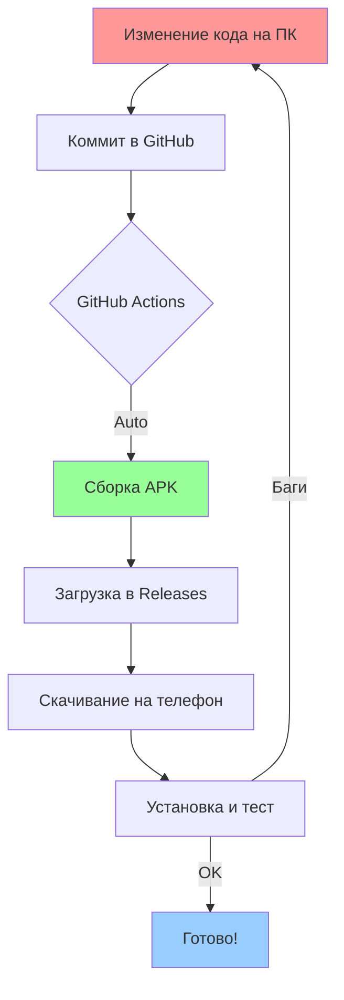

# 📁 Полная структура проекта SKALPMAT Android

```
skalpmat-android/
│
├── 📱 main.py                    # KivyMD приложение (GUI для Android)
│   ├── Главный экран с логами
│   ├── Карусель открытых позиций
│   ├── Кнопки управления (Старт/Стоп/Статы/etc)
│   ├── Диалог настроек
│   └── Интеграция с SynergyBot
│
├── 🤖 synergy_bot_v7.py          # Ваша торговая логика (СКОПИРОВАТЬ ИЗ dist/)
│   ├── SynergyBot (главный класс)
│   ├── MeanReversionStrategy
│   ├── AdaptiveScalpingStrategy
│   ├── SmartTrailingStop
│   ├── MarketRegimeDetector
│   ├── SelfOptimizer
│   ├── GateIO (API обёртка)
│   ├── TelegramNotifier
│   └── TrailingStopManager
│
├── ⚙️ .env                        # Конфигурация (СКОПИРОВАТЬ ИЗ dist/)
│   ├── Telegram токен и Chat ID
│   ├── Gate.io API ключи (DEMO/REAL)
│   ├── Настройки стратегий
│   ├── Параметры риска
│   └── TP/SL настройки
│
├── 📦 requirements.txt           # Python зависимости
│   ├── flet (для десктоп теста)
│   ├── pandas, numpy, scipy
│   ├── requests, telebot
│   └── gate-api
│
├── 🔧 buildozer.spec             # Android сборка конфигурация
│   ├── Название приложения
│   ├──_permissions_
│   ├── Android API версия
│   └── Python требования
│
├── 📖 README.md                  # Полная документация
├── 🚀 START_HERE.md             # Быстрый старт (ЧИТАЙТЕ ПЕРВЫМ!)
├── 📝 copy_files.ps1            # PowerShell скрипт для копирования
│
├── 🌐 .devcontainer/
│   ├── devcontainer.json        # GitHub Codespaces конфигурация
│   └── setup.sh                 # Авто-установка зависимостей
│
└── 🔄 .github/
    └── workflows/
        └── build-apk.yml        # CI/CD для авто-сборки APK
            ├── Триггеры (push, manual)
            ├── Установка Android SDK
            ├── Buildozer сборка
            └── Загрузка в Releases
```

---

## 📊 Сравнение версий

| Компонент | Desktop (Flet) | Android (KivyMD) |
|-----------|----------------|------------------|
| GUI Framework | Flet | KivyMD |
| Основной код | ✅ synergy_bot_v6.py | ✅ synergy_bot_v7.py (без изменений) |
| Telegram | ✅ Работает | ✅ Работает |
| Gate.io API | ✅ Работает | ✅ Работает |
| SQLite БД | ✅ Работает | ✅ Работает |
| Threading | ✅ Работает | ✅ Работает |
| Pandas/Numpy | ✅ Работает | ✅ Работает |
| Логирование | ✅ Console | ✅ Console |
| Карусель позиций | ✅ Работает | ✅ Работает |
| Бэктест | ✅ Работает | ✅ Работает |
| Настройки UI | ✅ Flet Dialog | ✅ KivyMD Dialog |

---

## 🔄 Workflow разработки



---

## 🎯 Что уже готово

✅ **main.py** — KivyMD приложение с полным GUI
✅ **buildozer.spec** — Конфигурация для Android сборки
✅ **.devcontainer/** — GitHub Codespaces настройка
✅ **.github/workflows/** — CI/CD для авто-сборки
✅ **README.md** — Полная документация
✅ **START_HERE.md** — Инструкция для быстрого старта

---

## ⚠️ Что нужно сделать вам

1. **Скопировать synergy_bot_v6.py → synergy_bot_v7.py**
2. **Скопировать .env файл**
3. **Загрузить на GitHub**
4. **Запустить сборку** (Actions или Codespaces)

---

## 📱 Интерфейс приложения

```
┌─────────────────────────────────────────────┐
│  ☰  SKALPMAT V7                      ⚙️    │ ← Toolbar
├─────────────────────────────────────────────┤
│ ╔═════════════════════════════════════════╗ │
│ ║ [12:30:45] 🚀 Запуск skalpMat...       ║ │
│ ║ [12:30:46] ✅ Gate.io инициализирован  ║ │
│ ║ [12:30:47] ✅ Стратегия MR включена    ║ │
│ ║ [12:30:48] ✅ Стратегия AS включена    ║ │
│ ║ [12:31:00] 🔍 BTC_USDT (5m)            ║ │
│ ║ [12:31:15] ⚡ AS Signal: BUY           ║ │
│ ║ [12:31:16] ✅ Открыта buy: BTC_USDT    ║ ║
│ ║ ...                                     ║ │
│ ╚═════════════════════════════════════════╝ │
├─────────────────────────────────────────────┤
│ 🟢 BTC_USDT (buy) | Вход: 65432 → 65550   │ ← Карусель
│    | +11.80 USDT (+1.82%)                  │   позиций
├─────────────────────────────────────────────┤
│  💵 Баланс: 1023.45 USDT   PnL: +23.45    │ ← Статус
├─────────────────────────────────────────────┤
│  [▶️ Старт] [📊 Позиции] [📈 Статы]        │ ← Кнопки
│  [📋 Отчёт] [❌ Закрыть] [🧪 Бэктест]      │
│  [⚙️ Настройки] [❌ Выход]                  │
└─────────────────────────────────────────────┘
```

---

## 🎨 Цветовая схема (Dark Theme)

- **Фон**: Чёрный (#000000)
- **Логи**: Зелёный текст (Consolas)
- **Позиции**: 🟢 Зелёный (прибыль), 🔴 Красный (убыток)
- **Кнопки**: 
  - Старт: Зелёный
  - Стоп: Красный
  - Статы: Фиолетовый
  - Настройки: Синий

---

## 🔧 Технические детали

### Минимальные требования Android:
- **Android**: 7.0+ (API 24)
- **Целевой API**: Android 12 (API 31)
- **Архитектура**: arm64-v8a
- **RAM**: 2GB+ (рекомендуется 4GB)
- **Место**: ~50MB (APK), ~200MB (установленное)

### Сборка:
- **Время первой сборки**: 30-40 минут
- **Повторная сборка**: 5-10 минут
- **Размер APK**: ~30-40MB (debug)

---

## 📞 Контакты

Вопросы и предложения: GitHub Issues

---

**Версия проекта**: 7.0.0  
**Дата**: Июнь 2026  
**Лицензия**: MIT